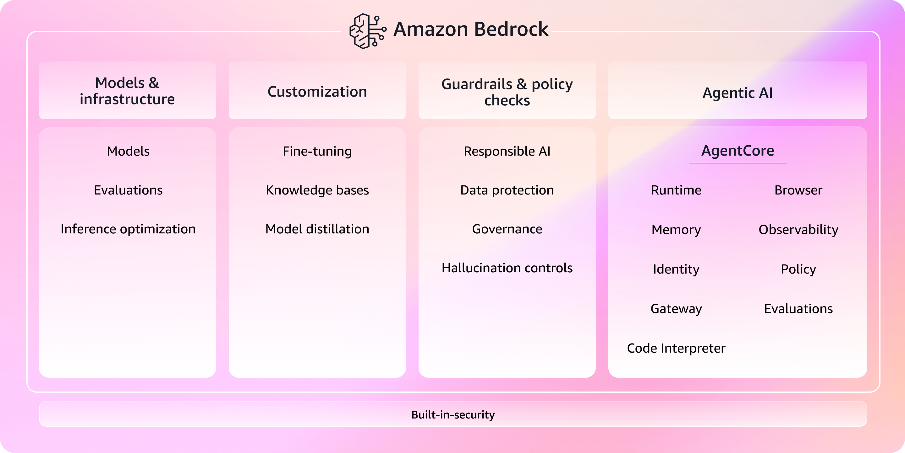

# awsbedrock

AWS BedRock is the platform for building generative AI applications and agents at production scale

The core capabilities you need for building production AI in one platform.

[Model and Infrastructure] ("model_infrastructure.md")
